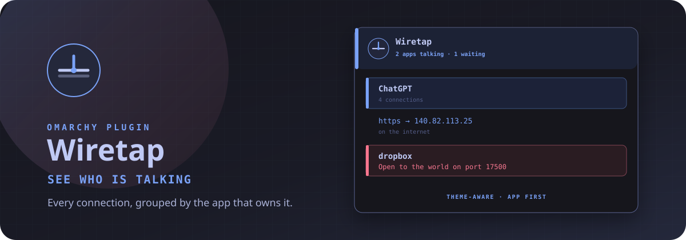

# Wiretap



See who is talking. Wiretap groups every connection on this machine by the app that owns it.

Network associates you to an AP. Wiretap shows who is on the wire.

## Watch it work

https://github.com/user-attachments/assets/e72e82a6-91ad-4764-b880-9928f9c20f6a

A 14-second soundtracked loop of the mark, the live panel, and the verbs. Its
distinct cyber-electronic score rides a restrained 100 BPM pulse, with the
synth layer opening as the end card arrives. Rebuild the stills and video with
`docs/demo/record`; the one-minute live-take plan is in [docs/DEMO.md](docs/DEMO.md).

## Install

```sh
omarchy plugin add https://github.com/thebenwalther/omarchy-wiretap.git --enable
```

## Usage

Click the bar mark to open or close the inspector. Press Escape to close it.

The bar stays quiet until something is talking on the internet — then a count appears next to the mark. A new outbound conversation flashes the contact on the glyph.

- Left-click: open or close the inspector
- Right-click: cycle All → Talking → Waiting → Internet → This computer
- Middle-click: refresh now

Inside the panel, apps are the parents. Open one to see who it is talking to, waiting for, or finishing with. Type to search. `j`/`k` move. Enter opens an app or copies a row.

Colors follow the current Omarchy theme: accent for talking, urgent for open-to-the-world.

| Key | Action |
| --- | --- |
| `/` | Find an app, site, or port |
| `j` `k` | Move |
| `h` `l` | Hide / show details |
| `Enter` | Open an app or copy a row |
| `c` | Copy the cursor row |
| `e` | Copy the list |
| `E` | Write `~/Downloads/wiretap-<unix>.json` |
| `a` / `A` | Show all / hide details |
| `1`–`5` | All, Talking, Waiting, Internet, This computer |
| `r` | Refresh |
| `s` | Show or hide system apps |
| `Esc` | Close |

Shell open and close use the bar-widget id, the same route Quattro uses for panel hotkeys:

```sh
omarchy-shell shell summon io.github.thebenwalther.wiretap '{}'
omarchy-shell shell hide io.github.thebenwalther.wiretap
```

CLI, if you want a machine-readable snapshot without the bar:

```sh
bin/wiretap snapshot --pretty
bin/wiretap snapshot --include-system --include-unconnected-udp
```

Local sockets stay hidden unless you pass `--include-unix`. Reverse DNS is not on the poll path. Wiretap does not overwrite configuration except the bar-widget settings you change yourself.

## Configure

```sh
omarchy bar move io.github.thebenwalther.wiretap --section right
```

Place it beside `omarchy.network`. The interface widget and the conversation inspector are a pair.

Refresh speed, hidden classes, and the default view are bar-widget settings on that layout entry.

## Requirements

- Omarchy Quattro with shell plugin support
- `iproute2` (`ss`) — already on Omarchy
- `wl-copy` for clipboard actions
- No additional packages. No sudo or pkexec is required.

## Remove

```sh
omarchy plugin remove io.github.thebenwalther.wiretap
```

## Development

```sh
ln -sfn "$HOME/Work/wiretap" \
  "$HOME/.config/omarchy/plugins/io.github.thebenwalther.wiretap"
omarchy plugin enable io.github.thebenwalther.wiretap --section right
omarchy plugin validate "$HOME/Work/wiretap"
tests/all
docs/demo/record
```

## License

MIT
